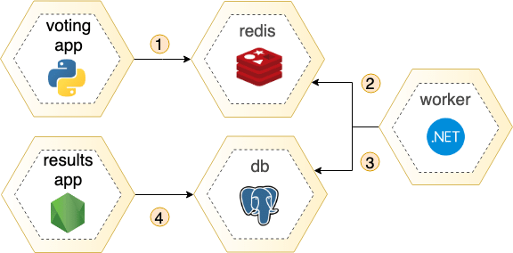

# Voting App

A lightweight and scalable voting application designed for modern environments. It is deployed on Kubernetes using both pods and deployment files, allowing for flexibility in how the app is managed and scaled.

---

## Features

- User-friendly interface for voting.
- Real-time results update.
- Scalable and containerized architecture.
- Highly available and fault-tolerant.

---

## Tech Stack

- **Frontend**: Python (voting page), Node.js (results page)
- **Backend**: .NET for processing votes
- **Database**: PostgreSQL
- **Cache**: Redis for caching voting data
- **Containerization**: Docker
- **Orchestration**: Kubernetes
- **Cloud Provider**: Amazon EKS (Elastic Kubernetes Service)

---

## System Architecture

Below is the system architecture of the voting app:

---

## Overview of Deployment

This project provides two approaches to deployment:

1. **Pod-Based Deployment**: Directly running the containers within individual pods.
2. **Deployment-Based Deployment**: Using Kubernetes deployment files to manage replicas and scaling.

Detailed steps for both methods are provided in their respective README files:

- [voting-app-Pod-Based Deployment Instructions](./README-pods-steps.md)
- [voting-app-Deployment-Based Deployment Instructions](./README-deployment-steps.md)

---

## Usage
![pictures-of-the-project-running:]
(./pictures-of-the-project-running/1.png)
(./pictures-of-the-project-running/2.png)
(./pictures-of-the-project-running/3.png)
(./pictures-of-the-project-running/4.png)
(./pictures-of-the-project-running/5.png)
(./pictures-of-the-project-running/deleting-project-files.png)
